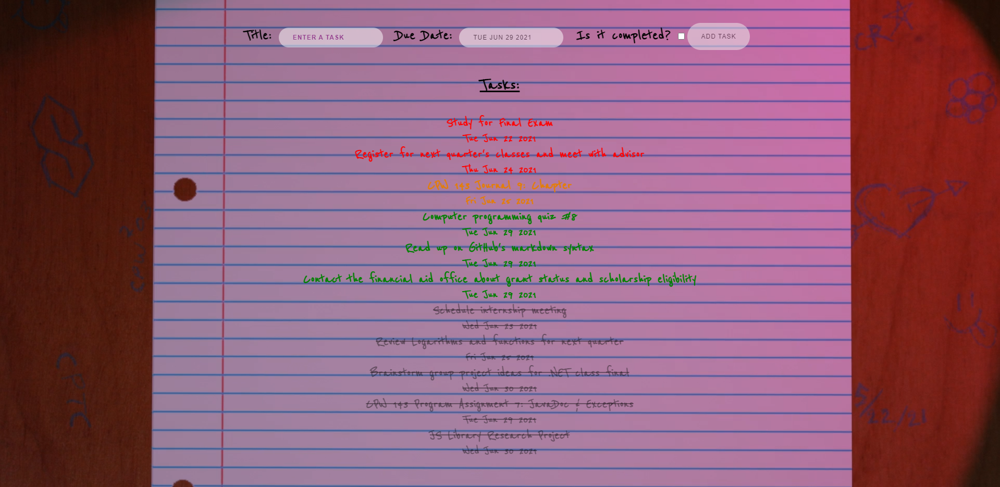

# JSLibraryResearchProject (Spring 2021)
This website demonstrates the BIDEO.JS Library that allows a video background. I have animated a scene using Blender that depicts a school desk in a dark room with a flickering light cast on notebook paper where the todo list tasks are populated by the user. 

##Check out the live webpage here: https://rothlisbergerc.github.io/JSLibraryResearchProject/

